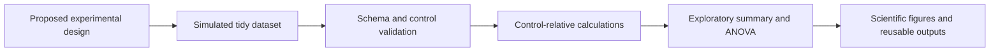
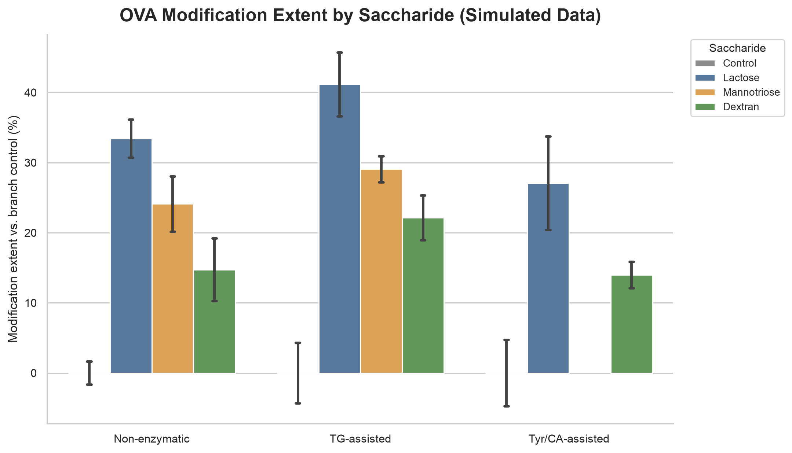
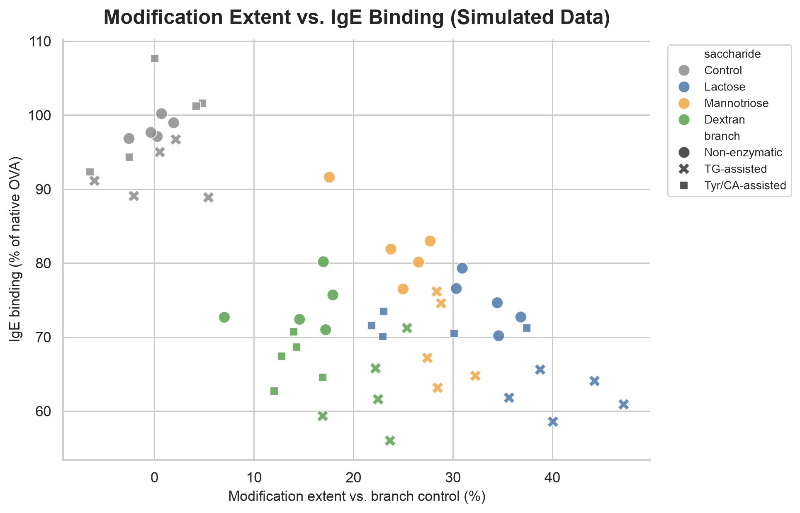

# OVA Saccharide Modification: A Python Analysis Prototype

A reproducible Python prototype for planning and testing a future data-analysis
workflow for ovalbumin (OVA) saccharide modification research.

> **Project status:** computational prototype only. No wet-lab experiment has
> been conducted for this repository. Every numerical value is simulated and
> must not be interpreted as an experimental result or biological conclusion.

## Why I Built This Project

This project translates an undergraduate food-science research question into a
transparent data structure and analysis workflow. It was developed to practise
Python, experimental-data organization, control-relative calculations,
exploratory statistics, scientific visualization, and reproducible research
before real laboratory data become available.

## What Is Real and What Is Simulated?

| Component | Status |
|---|---|
| Research topic and prospective experimental structure | Based on my SRDP planning |
| Saccharide classes and candidate analysis indicators | Based on the proposed study design |
| Python scripts, calculations, tests, and figures | Fully implemented and reproducible |
| All measurement values in the CSV files | Simulated for demonstration |
| Statistical outputs and apparent treatment patterns | Demonstration only |
| Experimental or clinical conclusions | None |

## Prospective Research Question

How could representative disaccharide, oligosaccharide, and polysaccharide
systems be compared in a future OVA modification study across:

1. non-enzymatic glycation;
2. transglutaminase (TG)-assisted glycosylation; and
3. tyrosinase/caffeic-acid (Tyr/CA)-assisted glycosylation?

The representative saccharides used in this prototype are:

- **Lactose** — disaccharide
- **Mannotriose** — oligosaccharide
- **Dextran** — polysaccharide

Their inclusion represents a proposed comparison framework, not a completed
experimental selection or efficacy ranking.

## Analysis Workflow



The workflow:

- generates a clearly labelled, reproducible simulated dataset;
- validates the input schema and branch-specific control groups;
- calculates modification extent relative to each branch control;
- calculates IgE-binding reduction relative to each branch control;
- summarizes results by proposed reaction branch and saccharide;
- runs one-way ANOVA as an exploratory programming demonstration;
- creates publication-style figures;
- accepts future experimental measurements in the same data format.

## Example Outputs

The figures below visualize simulated values only.





## Repository Structure

```text
.
├── data/
├── docs/
├── outputs/
├── src/
├── tests/
├── requirements.txt
└── README.md
```

## Quick Start

```bash
python3 -m venv .venv
source .venv/bin/activate
pip install -r requirements.txt

python src/generate_example_data.py
python src/analyze_experiment.py
python -m unittest discover -s tests -v
```

Windows activation command:

```powershell
.venv\Scripts\activate
```

## Future Use

If properly collected experimental data become available, a separate copy of
the CSV can be prepared using the schema in `data/README.md`. Any real analysis
would still require confirmation of experimental design, biological
replication, statistical assumptions, multiple-comparison procedures, and
appropriate immunological validation.

## Skills Demonstrated

- Python data handling with pandas and NumPy
- control-relative metric calculation
- exploratory statistics with SciPy
- scientific visualization with Matplotlib and Seaborn
- reproducible dataset generation
- input validation and automated testing
- translation of a research plan into a computational workflow

## Author

**Yibei (Beverly) Tang**  
Food Science undergraduate, Ocean University of China and the University of
Adelaide  
[GitHub](https://github.com/Yibei-Beverly-Tang) ·
[LinkedIn](https://www.linkedin.com/in/yibei-tang-309b1b3b8)
