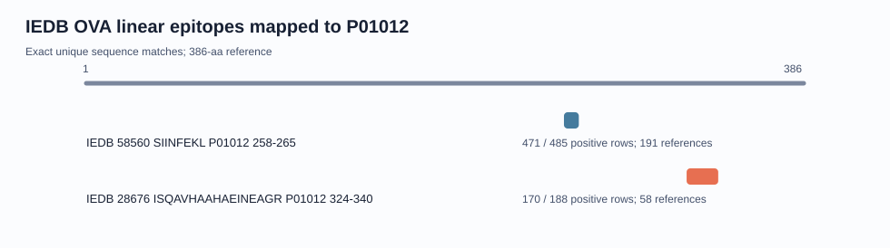

# Experimentally Observed OVA Epitope Report

> This is a conservative, non-exhaustive IEDB snapshot. Positive assay records do not by themselves establish human clinical allergenicity.

## Inclusion criteria

- Linear peptide assigned by IEDB to ovalbumin / UniProt P01012.
- At least one positive T-cell assay record.
- Peptide sequence maps exactly and uniquely to the repository's P01012 sequence.
- Canonical reference epitopes only; overlapping peptide-scan variants are excluded.

IEDB data retrieved through the official query API: 2026-08-02.

## Validated reference epitopes

| IEDB epitope | Sequence | P01012 interval | Response | Most common MHC | All assay rows | Positive rows | Positive references |
|---|---|---:|---|---|---:|---:|---:|
| [IEDB 58560](https://www.iedb.org/epitope/58560) | `SIINFEKL` | 258-265 | T cell | H2-Kb | 485 | 471 | 191 |
| [IEDB 28676](https://www.iedb.org/epitope/28676) | `ISQAVHAAHAEINEAGR` | 324-340 | T cell | H2-IAb | 188 | 170 | 58 |

Counts summarize positive rows and distinct reference IDs returned by the IEDB query API for each epitope ID. They are database-record counts, not effect sizes or counts of independent biological replications.

## Interpretation limits

- Most records use mouse hosts and mouse MHC contexts.
- A T-cell response is not equivalent to IgE binding or clinical food allergy.
- Negative records also exist and are not erased by reporting positive counts.
- The snapshot is intentionally not an exhaustive catalog of overlapping peptides.
- Database content can change after the recorded retrieval date.

