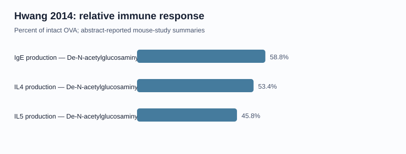
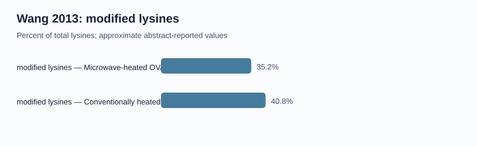

# OVA–Saccharide Public-Data Report

> Numerical evidence is transcribed from publication abstracts. It is not reconstructed raw data.

## Protein sequence characterization

| Record | Length | Mass (kDa) | pI | GRAVY | N-X-S/T motifs | Lys + Arg |
|---|---:|---:|---:|---:|---:|---:|
| sp|P01012|OVAL_CHICK | 386 | 42.88 | 5.023 | -0.001 | 2 | 35 |

Calculated properties are estimates for the unmodified sequence. Motifs are sequence candidates, not confirmed glycosylation sites.

## Publication-reported numerical evidence

| Study | Treatment | Metric | Value | Unit | Comparator | Source |
|---|---|---|---:|---|---|---|
| Wang_2013 | Native OVA | sequence_coverage | 100 | percent | OVA sequence | [DOI](https://doi.org/10.1016/j.foodchem.2013.04.045) |
| Wang_2013 | Glycated OVA | sequence_coverage | 95 | percent | OVA sequence | [DOI](https://doi.org/10.1016/j.foodchem.2013.04.045) |
| Wang_2013 | Microwave-heated OVA-glucose | modified_lysines | 35.2 | percent | total lysines | [DOI](https://doi.org/10.1016/j.foodchem.2013.04.045) |
| Wang_2013 | Conventionally heated OVA-glucose | modified_lysines | 40.8 | percent | total lysines | [DOI](https://doi.org/10.1016/j.foodchem.2013.04.045) |
| Hwang_2014 | De-N-acetylglucosaminylated OVA | relative_IgE_production | 58.8 | percent of intact OVA | intact OVA | [DOI](https://doi.org/10.1016/j.bbrc.2014.06.101) |
| Hwang_2014 | De-N-acetylglucosaminylated OVA | relative_IL4_production | 53.4 | percent of intact OVA | intact OVA | [DOI](https://doi.org/10.1016/j.bbrc.2014.06.101) |
| Hwang_2014 | De-N-acetylglucosaminylated OVA | relative_IL5_production | 45.8 | percent of intact OVA | intact OVA | [DOI](https://doi.org/10.1016/j.bbrc.2014.06.101) |

These are author-reported summary values. They cannot support new p-values or pooled effect sizes without the original measurements.

## Publication-reported residue annotations

| Study | Annotation | Reported site | UniProt site | Offset | Validation | Source |
|---|---|---|---|---:|---|---|
| Ito_2007 | N-linked glycosylation | Asn-292 | N-293 | +1 | matched | [DOI](https://doi.org/10.1093/glycob/cwl077) |
| Mao_2023 | glycation-associated site | Arg-84 | R-85 | +1 | matched | [DOI](https://doi.org/10.1016/j.ijbiomac.2023.123640) |
| Mao_2023 | glycation-associated site | Lys-92 | K-93 | +1 | matched | [DOI](https://doi.org/10.1016/j.ijbiomac.2023.123640) |
| Mao_2023 | glycation-associated site | Lys-206 | K-207 | +1 | matched | [DOI](https://doi.org/10.1016/j.ijbiomac.2023.123640) |
| Mao_2023 | glycation-associated site | Lys-263 | K-264 | +1 | matched | [DOI](https://doi.org/10.1016/j.ijbiomac.2023.123640) |
| Mao_2023 | glycation-associated site | Lys-322 | K-323 | +1 | matched | [DOI](https://doi.org/10.1016/j.ijbiomac.2023.123640) |
| Mao_2023 | glycation-associated site | Arg-381 | R-382 | +1 | matched | [DOI](https://doi.org/10.1016/j.ijbiomac.2023.123640) |

Residue numbering is retained as reported by each publication. A one-position difference can occur relative to the 386-aa UniProt sequence because of initiator-residue or mature-chain conventions.

## Interpretation boundary

The report is descriptive. It does not establish causality, clinical allergenicity, safety, or therapeutic efficacy.

