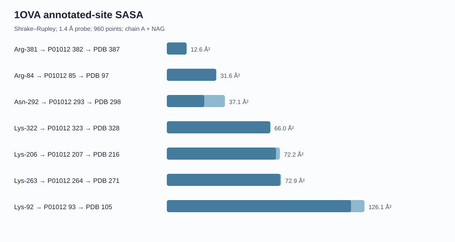

# OVA Solvent-Accessible Surface-Area Report

## Method

SASA was calculated with a deterministic Shrake–Rupley point-sampling implementation using Bondi-style elemental van der Waals radii.

- Structure context: 1OVA chain A protein plus chain A NAG
- Solvent probe radius: 1.4 Å
- Sphere points per atom: 960
- Resolved protein residues reported: 383
- Hydrogen atoms are absent from the deposited X-ray model.

Algorithm reference: [Shrake and Rupley (1973)](https://doi.org/10.1016/0006-3495(73)90011-9). Atomic-radius reference: [Bondi (1964)](https://doi.org/10.1021/j100785a001).

## Annotated modification sites

| Reported site | P01012 | PDB | Total SASA | Side-chain SASA |
|---|---:|---|---:|---:|
| Arg-84 | 85 | ARG97 | 31.607 Ų | 31.481 Ų |
| Lys-92 | 93 | LYS105 | 126.102 Ų | 117.526 Ų |
| Lys-206 | 207 | LYS216 | 72.174 Ų | 69.658 Ų |
| Lys-263 | 264 | LYS271 | 72.924 Ų | 72.319 Ų |
| Asn-292 | 293 | ASN298 | 37.078 Ų | 23.886 Ų |
| Lys-322 | 323 | LYS328 | 66.023 Ų | 66.023 Ų |
| Arg-381 | 382 | ARG387 | 12.621 Ų | 12.621 Ų |

## IEDB epitope intervals

| IEDB epitope | P01012 interval | Residues | Total SASA | Mean per residue | Side-chain SASA |
|---|---:|---:|---:|---:|---:|
| [IEDB 58560](https://www.iedb.org/epitope/58560) | 258-265 | 8 | 455.103 Ų | 56.888 Ų | 399.059 Ų |
| [IEDB 28676](https://www.iedb.org/epitope/28676) | 324-340 | 17 | 434.151 Ų | 25.538 Ų | 325.52 Ų |

## Interpretation limits

- Values are absolute SASA for one crystal structure, not relative SASA.
- No exposed/buried threshold is assigned because reference maxima vary by method.
- Crystal packing, missing hydrogens and conformational dynamics can alter SASA.
- Accessibility does not establish chemical reactivity or immune recognition.

