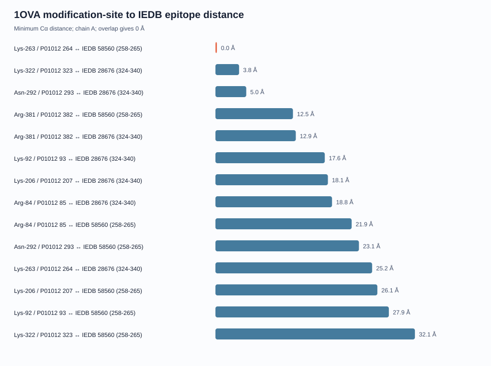

# OVA Modification-Site and Epitope Spatial Report

> Distances are geometric descriptors for chain A of experimental structure 1OVA. They do not demonstrate biochemical interaction or altered allergenicity.

## Epitope coordinate coverage

| IEDB epitope | P01012 interval | PDB interval | Resolved residues | Coverage |
|---|---:|---|---:|---:|
| [IEDB 58560](https://www.iedb.org/epitope/58560) | 258-265 | 265-272 (chain A) | 8/8 | 100.0% |
| [IEDB 28676](https://www.iedb.org/epitope/28676) | 324-340 | 329-345 (chain A) | 17/17 | 100.0% |

## Site-to-epitope relationships

| Reported site | P01012 site | IEDB epitope | Sequence separation | Within epitope | Nearest epitope residue | Minimum Cα distance |
|---|---:|---|---:|---|---|---:|
| Lys-263 | 264 | [IEDB 58560](https://www.iedb.org/epitope/58560) | 0 residues | True | K264 (PDB 271) | 0.0 Å |
| Lys-322 | 323 | [IEDB 28676](https://www.iedb.org/epitope/28676) | 1 residues | False | I324 (PDB 329) | 3.805 Å |
| Asn-292 | 293 | [IEDB 28676](https://www.iedb.org/epitope/28676) | 31 residues | False | V328 (PDB 333) | 4.957 Å |
| Arg-381 | 382 | [IEDB 58560](https://www.iedb.org/epitope/58560) | 117 residues | False | I260 (PDB 267) | 12.472 Å |
| Arg-381 | 382 | [IEDB 28676](https://www.iedb.org/epitope/28676) | 42 residues | False | A333 (PDB 338) | 12.93 Å |
| Lys-92 | 93 | [IEDB 28676](https://www.iedb.org/epitope/28676) | 231 residues | False | A333 (PDB 338) | 17.595 Å |
| Lys-206 | 207 | [IEDB 28676](https://www.iedb.org/epitope/28676) | 117 residues | False | N336 (PDB 341) | 18.095 Å |
| Arg-84 | 85 | [IEDB 28676](https://www.iedb.org/epitope/28676) | 239 residues | False | H329 (PDB 334) | 18.759 Å |
| Arg-84 | 85 | [IEDB 58560](https://www.iedb.org/epitope/58560) | 173 residues | False | F262 (PDB 269) | 21.916 Å |
| Asn-292 | 293 | [IEDB 58560](https://www.iedb.org/epitope/58560) | 28 residues | False | S258 (PDB 265) | 23.091 Å |
| Lys-263 | 264 | [IEDB 28676](https://www.iedb.org/epitope/28676) | 60 residues | False | A331 (PDB 336) | 25.212 Å |
| Lys-206 | 207 | [IEDB 58560](https://www.iedb.org/epitope/58560) | 51 residues | False | S258 (PDB 265) | 26.056 Å |
| Lys-92 | 93 | [IEDB 58560](https://www.iedb.org/epitope/58560) | 165 residues | False | F262 (PDB 269) | 27.904 Å |
| Lys-322 | 323 | [IEDB 58560](https://www.iedb.org/epitope/58560) | 58 residues | False | F262 (PDB 269) | 32.098 Å |

The minimum distance is measured between the modification site's Cα atom and all resolved Cα atoms in the epitope interval. A site inside an epitope has a trivial self-distance of 0 Å; this is sequence overlap, not evidence of an interaction.

## Interpretation limits

- 1OVA is one crystallographic state and may not represent solution dynamics.
- Cα proximity does not measure side-chain contact, binding or accessibility.
- The IEDB snapshot is a conservative mouse T-cell reference set.
- These results do not establish human IgE binding or clinical food allergy.

