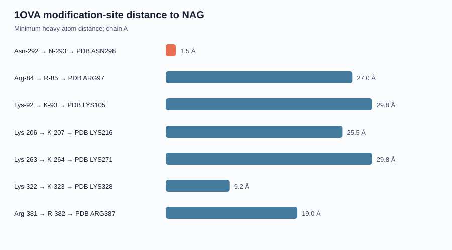

# OVA Three-Dimensional Structure Report

## Structure source

- PDB: [1OVA](https://www.rcsb.org/structure/1OVA)
- PDB DOI: [10.2210/pdb1OVA/pdb](https://doi.org/10.2210/pdb1OVA/pdb)
- Method: X-RAY DIFFRACTION
- Resolution: 1.95 Å
- Model: CRYSTAL STRUCTURE OF UNCLEAVED OVALBUMIN AT 1.95 ANGSTROMS RESOLUTION

Analysis below uses chain A. UniProt positions were mapped through the mmCIF polymer-sequence scheme rather than by assuming a constant numbering offset.

## Modification-site mapping

| Reported site | UniProt site | PDB site | Resolved | Distance to NAG | CA radius | Mean B-factor | Source |
|---|---|---|---|---:|---:|---:|---|
| Asn-292 | N-293 | ASN-298 (chain A) | True | 1.469 Å | 14.169 Å | 13.496 | [DOI](https://doi.org/10.1093/glycob/cwl077) |
| Arg-84 | R-85 | ARG-97 (chain A) | True | 26.985 Å | 15.397 Å | 29.629 | [DOI](https://doi.org/10.1016/j.ijbiomac.2023.123640) |
| Lys-92 | K-93 | LYS-105 (chain A) | True | 29.84 Å | 17.305 Å | 40.2 | [DOI](https://doi.org/10.1016/j.ijbiomac.2023.123640) |
| Lys-206 | K-207 | LYS-216 (chain A) | True | 25.539 Å | 26.483 Å | 51.011 | [DOI](https://doi.org/10.1016/j.ijbiomac.2023.123640) |
| Lys-263 | K-264 | LYS-271 (chain A) | True | 29.848 Å | 19.564 Å | 35.87 | [DOI](https://doi.org/10.1016/j.ijbiomac.2023.123640) |
| Lys-322 | K-323 | LYS-328 (chain A) | True | 9.211 Å | 24.439 Å | 46.516 | [DOI](https://doi.org/10.1016/j.ijbiomac.2023.123640) |
| Arg-381 | R-382 | ARG-387 (chain A) | True | 19.049 Å | 12.089 Å | 13.867 | [DOI](https://doi.org/10.1016/j.ijbiomac.2023.123640) |

The distance to NAG is the minimum heavy-atom distance to the crystallographic N-acetylglucosamine in the same chain. CA radius is distance from the chain-A Cα centroid; it is not a solvent-accessibility calculation.

## Closest annotated-site pairs

| Site A | Site B | Cα distance |
|---|---|---:|
| Mao_2023:84 | Mao_2023:92 | 11.941 Å |
| Ito_2007:292 | Mao_2023:322 | 15.808 Å |
| Mao_2023:206 | Mao_2023:381 | 16.754 Å |
| Mao_2023:263 | Mao_2023:381 | 17.045 Å |
| Ito_2007:292 | Mao_2023:381 | 17.763 Å |
| Ito_2007:292 | Mao_2023:84 | 24.181 Å |
| Mao_2023:84 | Mao_2023:322 | 24.594 Å |
| Mao_2023:84 | Mao_2023:263 | 26.918 Å |
| Mao_2023:84 | Mao_2023:381 | 27.034 Å |
| Mao_2023:92 | Mao_2023:381 | 27.674 Å |

## Interpretation limits

- Crystal coordinates describe one experimental structural state.
- A short geometric distance does not demonstrate biochemical interaction.
- B-factors are structure- and refinement-dependent.
- Epitope proximity is reported separately in `site_epitope_report.md`.
- Solvent accessibility requires a separate analysis.

A PyMOL script is provided at `scripts/visualize_1ova_sites.pml`.
